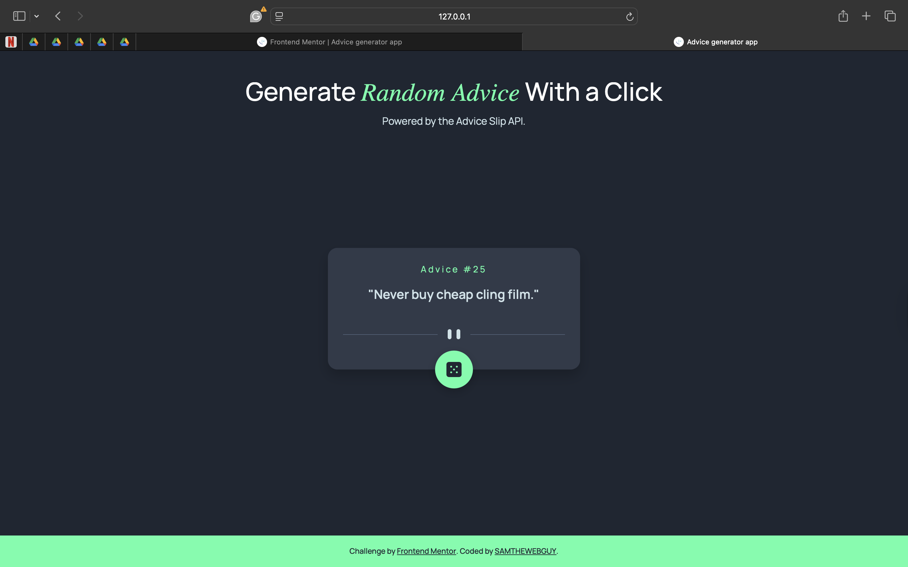

# Advice Generator App

This is my solution to the [Advice Generator App Challenge](https://www.frontendmentor.io/challenges/advice-generator-app-QdUG-13db) on Frontend Mentor.  
This challenge helped me improve my skills in working with APIs, handling asynchronous JavaScript, and creating clean, responsive layouts.

---

## Table of Contents

- [Overview](#overview)
  - [The Challenge](#the-challenge)
  - [Screenshot](#screenshot)
  - [Links](#links)
- [My Process](#my-process)
  - [Built With](#built-with)
  - [What I Learned](#what-i-learned)
- [Author](#author)

---

## Overview

### The Challenge

Users should be able to:

- View the optimal layout for the app depending on their device’s screen size  
- See hover states for all interactive elements  
- Generate a new piece of advice by clicking the dice icon  

### Screenshot



### Links

- **Live Site URL:** [View Live Site](https://advice-generator-app-alpha-khaki.vercel.app/)

---

## My Process

### Built With

- Semantic **HTML5** markup  
- **CSS custom properties**  
- **Flexbox**  
- **Mobile-first workflow**  
- **Vanilla JavaScript (Fetch API)**  

---

### What I Learned

This project helped me strengthen my understanding of working with APIs and updating the DOM dynamically using JavaScript.  

It also reinforced responsive design principles and handled user interactions smoothly.

Here’s a snippet of the function that fetches and displays new advice:

```js
function getAdvice() {
    adviceText.textContent = "Loading Advice...";
    fetch ('https://api.adviceslip.com/advice')
    .then (response => response.json())
    .then (data => {
        const advice = data.slip;
        adviceId.textContent = advice.id;
        adviceText.textContent = `"${advice.advice}"`;
    })

    .catch (error => {
        adviceText.textContent = "Oops! Couldn't load advice 😢";
        console.log ('Error fetching advice:', error);
    });
}

```
## Author

- GitHub - [@samthewebguy](https://www.github.com/samthewebguy)
- Frontend Mentor - [@samthewebguy](https://www.frontendmentor.io/profile/samthewebguy)
- X - [@technioo](https://www.x.com/technioo)
